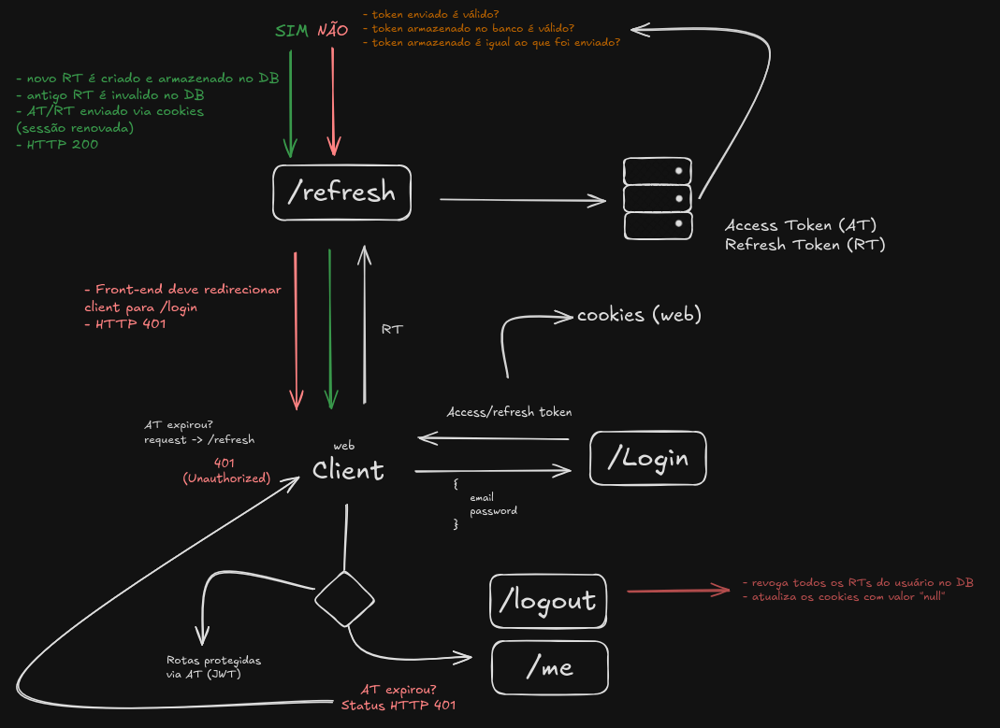
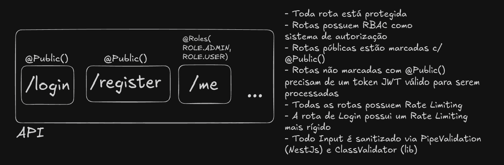

# Wallet Monitor Crypto

## 🔒 AUTH

### Navegação

- [Visão geral](#visão-geral)
- [Objetivo do projeto](#objetivo-do-projeto)
- [Fluxo de autenticação](#fluxo-de-autenticação)
- [Estratégia de sessão](#estratégia-de-sessão)
- [Autorização](#autorização)
- [Decisões de arquitetura](#decisões-de-arquitetura)

### Visão geral

Este módulo é responsável por autenticar usuários e proteger rotas privadas da aplicação.

Após um login bem-sucedido, o servidor emite dois tokens:

- **Access Token (AT):** token de curta duração usado para autenticar requisições em rotas protegidas
- **Refresh Token (RT):** token de maior duração usado para renovar a sessão sem exigir novo login

Quando o **AT** expira, o cliente deve chamar o endpoint de refresh para obter um novo par de tokens.  
O endpoint de logout é responsável por revogar a sessão ativa do usuário.

> Atualmente, este fluxo cobre clientes web, com transporte de credenciais via cookies.

### Objetivo do projeto

Este módulo foi desenvolvido para demonstrar uma estratégia de autenticação com foco em:

- proteção de rotas privadas
- gerenciamento seguro de sessão
- renovação controlada de credenciais
- revogação de sessão via refresh token
- separação entre autenticação (`401`) e autorização (`403`)

### Diagramas

#### Diagrama de autenticação

#### Diagrama de autorização

### Fluxo de autenticação

#### Login

- envio de e-mail e senha
- validação das credenciais
- geração de **AT** e **RT**
- armazenamento do refresh token no servidor
- envio dos tokens ao cliente via cookies

#### Acesso a rotas protegidas

- uso do **AT** nas rotas privadas
- validação do JWT em cada requisição
- retorno de `401` quando o token estiver ausente, inválido ou expirado

#### Refresh de sessão

- o cliente envia uma requisição para `/refresh`
- o servidor valida o **RT** recebido
- o refresh token armazenado é verificado no servidor
- o token anterior é invalidado
- um novo par de **AT/RT** é emitido
- os novos tokens são enviados novamente via cookies

#### Logout

- o cliente envia uma requisição para `/logout`
- os refresh tokens da sessão são revogados no servidor
- os cookies são limpos
- a sessão é encerrada

### Estratégia de sessão

Este projeto utiliza **Refresh Token Rotation**.

A cada requisição de refresh:

- um novo **RT** é emitido
- o token anterior é invalidado
- um novo **AT** é gerado
- a sessão continua sem exigir novo login

Essa estratégia reduz a reutilização de credenciais antigas e aumenta o controle sobre o ciclo de vida da sessão.

### Autorização

Além da autenticação, a API aplica regras de autorização sobre rotas protegidas.

- rotas públicas são marcadas explicitamente com `@Public()`
- rotas privadas exigem um JWT válido
- o acesso a recursos pode depender da role do usuário
- a autorização segue o modelo de **RBAC** (_Role-Based Access Control_)

### Decisões de arquitetura

#### 1️⃣ Uso de access token + refresh token

**Decisão:** separar a credencial usada nas requisições da credencial usada para renovar a sessão.

**Motivação:** o access token possui curta duração para reduzir a janela de abuso caso seja comprometido. Já o refresh token permite renovar a sessão sem exigir que o usuário faça login com frequência.

**Impacto:** essa abordagem equilibra segurança e experiência do usuário, evitando tanto credenciais de longa duração quanto sessões curtas demais.

#### 2️⃣ Persistência de refresh token no servidor

**Decisão:** armazenar o refresh token no servidor.

**Motivação:** isso permite tratar a sessão como uma entidade controlável, e não apenas como uma credencial autoassinada. Com isso, torna-se possível implementar logout efetivo, revogação antecipada e controle sobre o ciclo de vida da sessão.

**Impacto:** a autenticação deixa de ser totalmente stateless, mas ganha revogação, rastreabilidade e maior controle de sessão.

#### 3️⃣ Rotação de refresh token

**Decisão:** emitir um novo refresh token sempre que a sessão for renovada.

**Motivação:** um refresh token reutilizável é mais perigoso porque, se comprometido, pode ser usado repetidamente para gerar novos access tokens até expirar. Com rotação, cada renovação substitui o token anterior e reduz a utilidade prática de um token vazado.

**Impacto:** aumenta a segurança do fluxo de renovação e permite rejeitar tentativas de reuso.

#### 4️⃣ Invalidação do token anterior

**Decisão:** invalidar o refresh token anterior assim que um novo for emitido.

**Motivação:** isso garante que apenas a credencial mais recente possa renovar a sessão. Sem essa invalidação, tokens antigos continuariam válidos em paralelo, o que enfraquece a rotação e amplia a superfície de abuso.

**Impacto:** a rotação passa a ter valor real como mecanismo de contenção, reduzindo o conjunto de credenciais válidas.

#### 5️⃣ Uso de cookies para aplicações web

**Decisão:** armazenar os tokens em cookies `HttpOnly` no contexto web.

**Motivação:** cookies `HttpOnly` reduzem a exposição dos tokens a scripts executados no navegador, mitigando o impacto de XSS em comparação com storages acessíveis por JavaScript. Em conjunto com `Secure` e `SameSite`, também fortalecem o transporte dessas credenciais no browser.

**Impacto:** a aplicação ganha uma estratégia mais segura de armazenamento no cliente web, embora exija configuração cuidadosa dos cookies.

#### 6️⃣ Uso de `401` em falhas de autenticação

**Decisão:** retornar `401 Unauthorized` quando a requisição não apresentar credenciais válidas.

**Motivação:** esse status sinaliza que o token está ausente, expirado, inválido ou revogado, permitindo que o cliente tente renovar a sessão por meio do refresh token. Se a renovação também falhar, o fluxo deve redirecionar o usuário para autenticação novamente.

**Impacto:** o cliente consegue distinguir falhas de autenticação de falhas de autorização. Assim, `401` indica necessidade de reautenticação, enquanto `403` fica reservado para casos em que o usuário está autenticado, mas não possui permissão para acessar o recurso solicitado.
